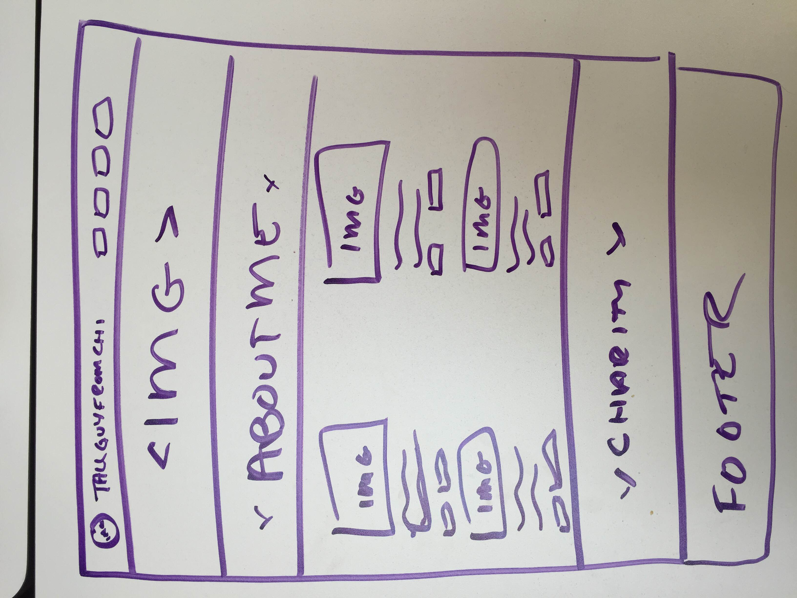

*******************************************************

**Purpose:** Create a portfolio page to display all projects I have worked on and display some more information about me and my passions!
-*******************************************************

**Technologies Used:**
- HTML
- CSS
- javascript
- jQuery
- Materialize framwork

**Approach Taken:**

I wanted a responsive and well thought out layout that conveyed my personality as well as my work in a professional yet true-to-form manor.

I wanted this to be a single page app to allow for an easy-to-navigate page.

**Installation Instructions:**

Follow <a href="http://wileysb88.github.io/portfolio/">THIS LINK</a> and check out my work!

**Unsolved Problems**

- I am hoping to use this layout and create a blog that will be up and running to continue my brand as a whole.

- While it is very responsive there are a few things that I did not edit perfectly to my liking.

- Still need to add certain hover effects and fade in and fade out effects.
